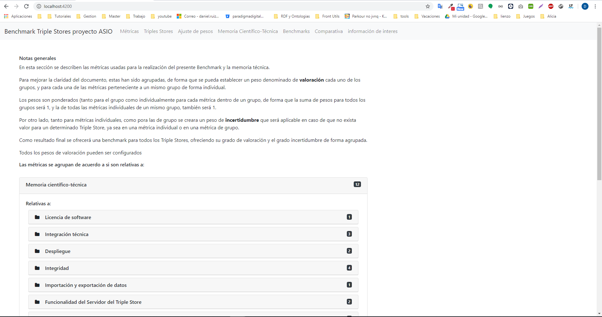
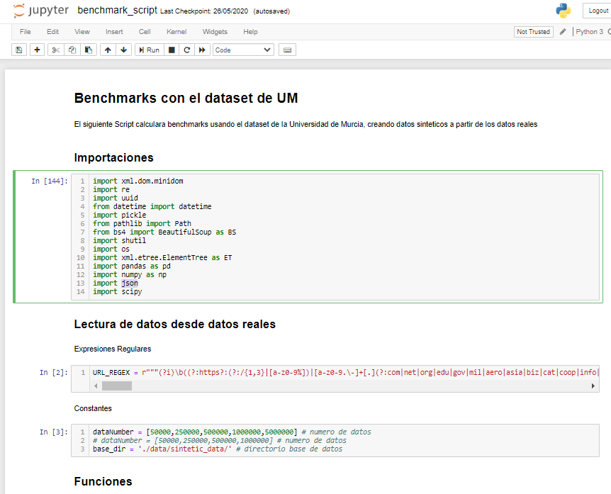

| Documento | [Métricas FAIR](README.md) - Manual de despliegue            |
| --------- | ------------------------------------------------------------ |
| Fecha     | 25/05/2020                                                   |
| Proyecto  | [ASIO](https://www.um.es/web/hercules/proyectos/asio) (Arquitectura Semántica e Infraestructura Ontológica) en el marco de la iniciativa [Hércules](https://www.um.es/web/hercules/) para la Semántica de Datos de Investigación de Universidades que forma parte de [CRUE-TIC](http://www.crue.org/SitePages/ProyectoHercules.aspx) |
| Módulo    | Arquitectura Semántica                                       |
| Tipo      | Manual de despliegue                                         |

# Benchmarks - Manual de despliegue

El presente documento describe en detalle el proceso de instalación del software de la aplicación Web para la visualización, análisis y gestión de las métricas de evaluación de Triple Stores y la ejecución de el Notebook Jupyter para la generación de nuevas métricas.

## Instalación de software para Benchmarks App (Visualización)

La aplicación web esta desarrollada completamente mediante [Angular](https://angular.io/), lo que significa que es una aplicación [SPA](https://en.wikipedia.org/wiki/Single-page_application), destinada a ejecutarse en un navegador.

Existen varias formas de despliegue que describiremos a continuación:

### Ejecución con Angular_CLI

[Angular CLI](https://cli.angular.io/), es una herramienta de desarrollo Web, diseñada para facilitar tareas comunes a los desarrolladores tales como creación, generación, ejecución, testing o despliegue. Para este proyecto usaremos la versión 7.3.9

Los únicos requisitos son tener instalados previamente Node.js y NPM, en caso de no estar instalados previamente se pueden descargar ambos en el siguiente [enlace](https://nodejs.org/es/download/).

No existen requisitos específicos de hardware.

Para instalar angular-cli, una vez instalado npm, es necesario ejecutar el siguiente comando desde la consola 

```bash
npm i @angular/cli@7.3.9
```

#### Ejecución

Una vez instalado podemos ejecutarlo en nuestro navegador de forma local, situándonos en la carpeta raíz del proyecto (**benchmarks_app**), mediante el siguiente comando:

```bash
ng serve
```

y por defecto, si no se indica otro puerto, podremos acceder a la aplicación web en nuestro navegador por el puerto 4200, mediante la URL http://localhost:4200, accediendo a así a la pagina principal de la aplicación web



#### Despliegue

Una vez instalado podemos construir la aplicación para su despliegue, situándonos en la carpeta raíz del proyecto (**benchmarks_app**), mediante el siguiente comando:

```bash
ng build --prod
```

Este comando creara la carpeta **dist**, que contiene todos los binarios necesarios para su despliegue en un servidor web (por ejemplo NGINX), y de esa forma realizar el despliegue en dicho servidor. 

### Ejecución/Despliegue con Docker

[Docker](https://www.docker.com/products/docker-desktop), es un proyecto de codigo abierto que automatiza el despliegue de aplicaciones dentro de contenedores de software, esto nos permitirá crear un contenedor virtualizado desplegable sobre cualquier hardware.

El único requisito es tener instalado docker, lo cual podemos realizar siguiendo los pasos detallados en el siguiente [enlace](https://docs.docker.com/get-docker/).

Una vez instalado, en la base del proyecto existe un fichero **[Dockerfile](https://docs.docker.com/engine/reference/builder/)**, con los comandos necesarios para construir un contenedor con un servidor [NGINX](https://nginx.org/en/), con la aplicación benchmarks_app desplegada en el.

Para crear el contendor a partir de el **[Dockerfile](https://docs.docker.com/engine/reference/builder/)**, situándonos en la carpeta raíz del proyecto (**benchmarks_app**), hay que ejecutar el siguiente comando:

```bash
docker build . -t benchmarks_app:1.0.0 .
```

Dicho comando (según se define en el DockerFile) creara un contenedor básico con un servidor [NGINX](https://nginx.org/en/), con Node.js ,NPM y angular-cli instalados, y sobre el, primero descargara las dependencias de la aplicación angular, y posteriormente compilara y desplegara los binarios dentro de dicho contenedor.

Una vez creado el contenedor podemos desplegarlo mediante el siguiente comando:

```bash
docker run -d -p 80:80 benchmarks_app:1.0.0
```

donde el argumento -d, indica que se ejecute en 2 plano (no bloque la terminal) y -p 4200:80, mapea el puerto externo 4200 (podría ser cualquier otro puerto libre) con el puerto interno 80, en el que escucha el servidor NGINX, de forma que a partir de ese momento la aplicación estará disponible en el navegador mediante la URL http://localhost:4200, accediendo a así a la pagina principal de la aplicación web


### Ejecución/Despliegue con Docker Compose

[Docker Compose](https://docs.docker.com/compose/) es una herramienta para definir y ejecutar aplicaciones Docker de contenedores múltiples. Con Compose, utiliza un archivo YAML para configurar los servicios de su aplicación. Luego, con un solo comando, crea e inicia todos los servicios desde su configuración. Para obtener más información sobre todas las características de Compose, consulte [la lista de características](https://docs.docker.com/compose/#features) .  Para instalar Docker Compose, es necesario seguir las instrucciones del siguiente [enlace](https://docs.docker.com/compose/install/)

El único requisito es tener instalado docker, lo cual podemos realizar siguiendo los pasos detallados en el siguiente [enlace](https://docs.docker.com/get-docker/).

Una vez instalado, en la base del proyecto existe un fichero **docker-compose.yaml**, con las especificaciones necesarias para construir y ejecutar un contenedor con la aplicación desplegada.

Para crear el contendor a partir de el fichero **docker-compose.yaml**, situándonos en la carpeta raíz del proyecto (**benchmarks_app**), hay que ejecutar el siguiente comando:

```bash
docker-compose up -d
```

Dicho comando, usara el fichero Dockerfile para construir la imagen, y la desplegara sobre el puerto 8081, tal y como esta definido en el fichero **docker-compose.yaml** y por lo tanto la aplicación esta disponible desde ese momento en la URL http://localhost:8081 accediendo a así a la pagina principal de la aplicación web


## Generación de Benchmarks propios con Notebook Jupyter (Benchmarks propios)

Para evaluar el rendimiento de distintos triple stores, con datos propios de el proyecto, se ha creado el Notebook Jupyter **benchmark_script.ipynb**.

Para poder ejecutarlo es necesario:

- Python 3: [instrucciones de instalación](https://www.python.org/downloads/).
- Jupyter Notebooks: ejecutar el siguiente comando

```bash
pip3 install jupyter
```

- o alternativamente instalar anaconda: [instrucciones de instalación](https://www.anaconda.com/products/individual)

El Notebook tiene dependencias con varias librerías Python definidas en el fichero [requirements.txt](requirements.txt):

```
pathlib2==2.3.3
numpy==1.18.5
pandas==0.24.2
scipy==1.4.1
```
Para la instalación de las dependencias se debe ejecutar el siguiente comando en la consola del equipo destinado a ejecutar el script:

```
pip install -r requirements.txt
```

Para ejecutar el Notebook hay que ejecutar el siguiente comando

```bash
jupyter notebook
```

que nos llevara hasta el home definido, por lo que únicamente hay que navegar hasta la localización del script y abrirlo, y entonces podremos ejecutarlo



