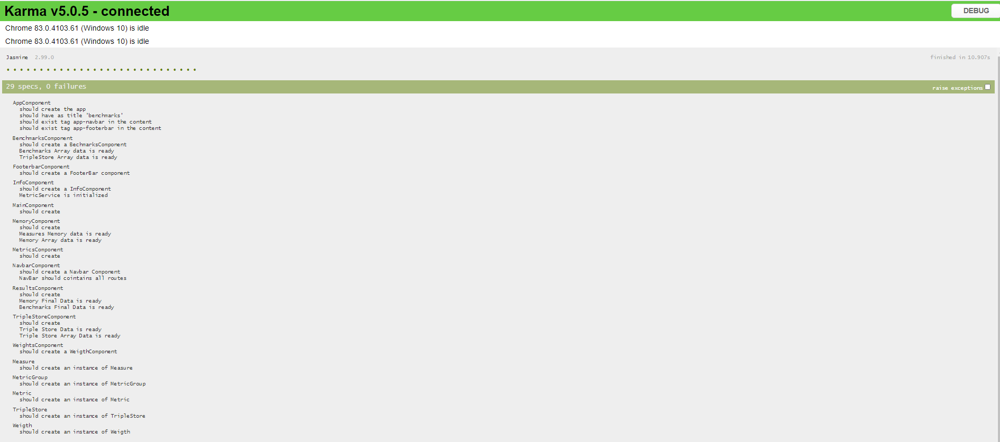

| Documento | [Métricas FAIR](README.md) - Documentación técnica           |
| --------- | ------------------------------------------------------------ |
| Fecha     | 25/05/2020                                                   |
| Proyecto  | [ASIO](https://www.um.es/web/hercules/proyectos/asio) (Arquitectura Semántica e Infraestructura Ontológica) en el marco de la iniciativa [Hércules](https://www.um.es/web/hercules/) para la Semántica de Datos de Investigación de Universidades que forma parte de [CRUE-TIC](http://www.crue.org/SitePages/ProyectoHercules.aspx) |
| Módulo    | Arquitectura Semantica                                       |
| Tipo      | Documentación técnica                                        |

# Métricas FAIR - Documentación técnica

El presente documento describe en detalle el proceso de desarrollo del software de la aplicación Web para la visualización, análisis y gestión de las métricas de evaluación de Triple Stores y la ejecución de el Notebook Jupyter para la generación de nuevas métricas (Benchmarks propios).

## Entorno de desarrollo
Ver [manual de despliegue](manual_despliegue.md).
## Generación de Benchmarks Propios

### Detalles de implementación

Para evaluar el rendimiento de distintos triple stores, con datos propios de el proyecto, se ha creado el Notebook Jupyter **benchmark_script.ipynb**.

Como descripción de alto nivel de este Script, podríamos decir que su función principal en las siguientes fases:

- Obtención de datos reales
- Generación de datos sintéticos, en paquetes de datos, hasta alcanzar  los valores definidos en la constante dataNumber, que en el momento de redacción de este documento están fijados en 50k, 250k, 500k, 1M y 5M de entidades (de media cada entidad tiene aprox. 8 líneas RDF), por lo que a partir de las entidades reales, se generaran paquetes de datos sintéticos hasta el número de entidades fijadas por la constante.
- Inserción de entidades en Triple Store definidos (en este momento Trellis y BlazeGraph) y medición de tiempos de escritura (para cada conjunto de datos). 
- Ejecución de las queries definidas y medición de tiempos de lectura (para cada conjunto de datos).
- Inserción de resultados en sistema de almacenamiento (firebase)

En el propio script aparecen documentadas a bajo nivel (mediante Markdown), cada una de las secciones de código, y en detalle, la acción que realizan, por lo que en este documento solo se describirá a alto nivel las secciones relevantes de dicho Script.

- **Importaciones:** Importaciones de librerías usadas en este script.
- **Constantes:** Constantes definidas, para uso en el Script.
- **Funciones:** Funciones a usar en el Script, entre ellas:
  - **parseRDF:** a partir de una ruta, obtiene el fichero con datos reales, que servirán de semilla para generar datos sintéticos. Retorna una tupla con una lista de los RDFs y otra lista de los tipos (clases) encontradas.
  - **utf8len:** a partir de un String, retorna su tamaño en bytes.
  - **create_uuid_pattern:** retorna una expresión regular para validar si un String es un UUID.
  - **generateData:** Recibe como parámetros los datos reales que actúan como semilla obtenidos por la función parseData y un entero con el volumen final de entidades que queremos generar. El resultado final serán los datos reales + datos sintéticos (tantos como sean necesarios para alcanzar el tamaño n, pasado como parámetro)
  - **save_obj:** Usada para guardar los datos sintéticos, y evitar generar de nuevo dichos datos, si estos ya han sido generados anteriormente.
  - **load_obj:** Usada para leer los datos sintéticos desde un fichero, si estos ya fueron generados anteriormente.
- **Generación de datos sintéticos hasta máximo:** Script que usando las funciones antes descritas, genera los datos sintéticos, a partir de las datos reales. Escribe los datos generados en ficheros de un tamaño tolerado por el EndPoint SPARQL en la ruta **./data/sintetic_data**, con el nombre del fichero siguiendo el siguiente patrón: **dataset\_{conjunto_de_ datos_definido_por_dataNumber}\_from\_{numero primera entidad incluida}\_to\_{numero última entidad incluida}.txt**
- **Queries:** Queries usadas para medir el rendimiento de el Triple Store en operaciones de lectura.
- **General Triple Stores:** funciones generales para cualquier triple store, entre las cuales estan:
  - **sendDataFromFile:** función encargada de realizar la petición SPARQL al TripleStore para realizar la escritura. Recibe como parámetro el path del fichero a enviar, el host , el puerto y el path hasta el EndPoint SPARQL.
  - **sendQuery:** función encargada de realizar la petición SPARQL al TripleStore para ejecutar una query de lectura. Recibe como parámetro la query, el host , el puerto y el path hasta el EndPoint SPARQL.
- **FUSEKI + TDB:** Script para realizar la inserción en TDB (por invocaciones al EndPoint de Fuseki), de todos los ficheros sintéticos generados en los pasos anteriores, y realizar las Queries indicadas, midiendo los tiempos de respuesta en ambos casos para los volúmenes de datos definidos por la constante **dataNumber**.
- **BlazeGraph:** Script para realizar la inserción en BlazeGraph, de todos los ficheros sintéticos generados en los pasos anteriores, y realizar las Queries indicadas, midiendo los tiempos de respuesta en ambos casos para los volúmenes de datos definidos por la constante **dataNumber**.
- **Enviar datos a Firebase:** Dar formato a los resultados para que puedan ser consumidos por la aplicación **benchmarks_app** y enviarlos a Firebase para su almacenamiento.

### Librerías empleadas

Para el desarrollo de este módulo software se han empleado 4 librerías Python, en concreto:

```
pathlib2==2.3.3
numpy==1.18.5
pandas==0.24.2
scipy==1.4.1
```

Para la instalación de las dependencias se debe ejecutar el siguiente comando en la consola del equipo destinado a ejecutar el script:

```
pip install -r requirements.txt
```

## Benchmarks App (Visualización)

La aplicación web esta desarrollada completamente mediante [Angular](https://angular.io/), lo que significa que es una aplicación [SPA](https://en.wikipedia.org/wiki/Single-page_application), destinada a ejecutarse en un navegador.

Para desplegar la aplicación podemos consultar el [manual de despliegue](manual_despliegue.md).

### Detalles de implementación

La aplicación básicamente esta generada siguiendo una arquitectura típica de una aplicación desarrollada en angular:

- **models:** Objetos básicos (POJOS), que actúan como contenedores de datos.
- **services:** Encapsula la logica de la aplicación. Básicamente la aplicación tiene un único servicio singleton, que lee (las métricas) y escribe los datos (pesos) en Firebase, y a partir de ellos crea las estructuras de datos óptimas a partir de los models, para que estos sean consumidos por los controladores.
- **components:** Controladores que capturan las peticiones del usuario y gestionan las peticiones a el servicio, para obtener los datos necesarios  para renderizar las vistas.
- **templates:** HTML a renderizar. Se comunica con el controlador para obtener los datos.


### Pruebas unitarias

Para generar los resultados de la evaluación de pruebas unitarias de la aplicación angular es necesario ejecutar el comando:

```
ng test
```

Tras lo cual se ejecutaran todos los test definidos, y podremos visualizar el resultado en http://localhost:9876/

