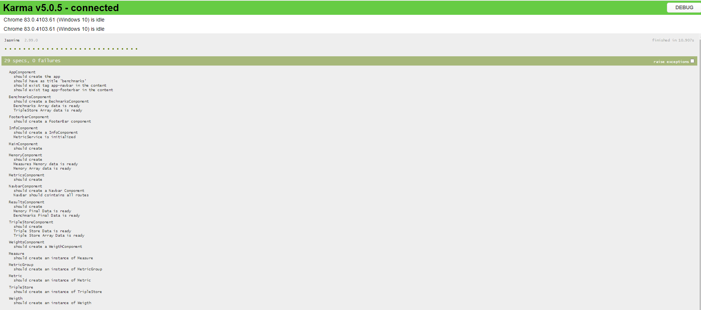

### Pruebas unitarias

Para generar los resultados de la evaluación de pruebas unitarias de la aplicación angular es necesario ejecutar el comando:

```
ng test
```

Tras lo cual se ejecutaran todos los test definidos, y podremos visualizar el resultado en http://localhost:9876/

